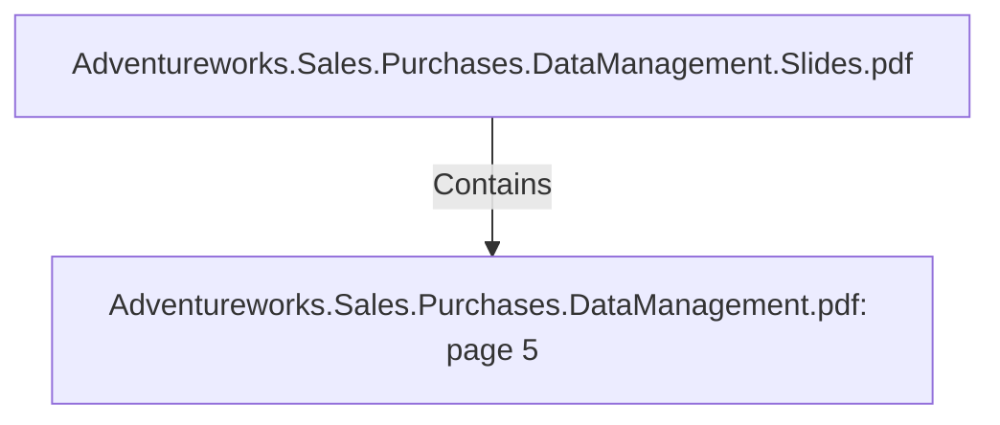

# Adventureworks.Sales.Purchases.DataManagement.pdf: page 5 (Section)

## Properties

| Key | Value |
|---|---|
| `excerpt` | 

 
 
 
 1. Project  Overview 

Adventure  Works  Cycles  will  create  Sales  and  Purchasing  datamarts  as  they  have  been 
p rioritized  by  the  comp any’s  management  to  be  the  areas  where  any  imp rovement  from 
the  analytics  insights  will  have  a  large  imp act  on  financial  key  p erformance  indicators.  

 
 2. Business  Challenges 

The  comp any  has  business  challenges  and  needs  an  analytics  solution  to  p rovide  insights 
on:  
 1 . Analyze  reseller  sales  vs  direct  consumer  sales 
over  sp ecific  holidays.  

2 . Create  top   5   p roducts  sales  ranking  by  seasons.  

3 . Create  top   5   p roducts  p rofit  ranking,   q uarter  by 
q uarter.  

4 . Create  a  top   5   Vendor  ranking  of  rejected  items  on 
p urchase  orders.    

5 . See  in  a  single  view  sold  items  vs  p urchased  items,  
for  each  p roduct  category 

 
   

 
   

  |
| `page` | 5 |
| `section_index` | 4 |

## Relationships

### Contains

- ← Adventureworks.Sales.Purchases.DataManagement.Slides.pdf (`f240004c-ab01-5ee9-a371-83bdd1c54d35`) — evidence: section 5 (page 5) extracted from Adventureworks.Sales.Purchases.DataManagement.pdf

## Diagram

## Evidence

- `23b9a852-85f9-4f1f-a6cd-f57824858980` — section 5 (page 5) extracted from Adventureworks.Sales.Purchases.DataManagement.pdf (confidence: 1.00)
