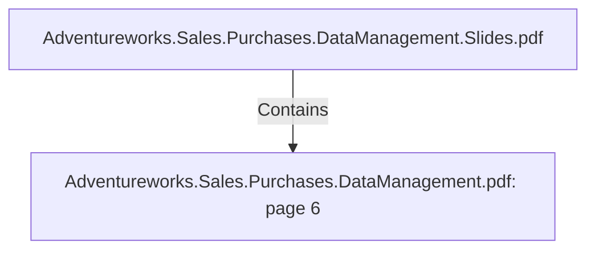

# Adventureworks.Sales.Purchases.DataManagement.pdf: page 6 (Section)

## Properties

| Key | Value |
|---|---|
| `excerpt` | 

 
 
 
 3. Technical  Architecture 

Kettle  will  be  used  to  extract,   transform  and  load  the  data  into  the  data  marts.  

Main  source  of  information  is  the  Adventure  Works  Transactional  database.    

Additional  data  sources:  

1 . Staging  database,   used  for  calculations,   with  self  generated  data.  
2 . Op en  data  for  getting  country  holidays  was  used  from  http s: //date. nager. at/   
3 . A  local  csv  for  calculating  seasons  across  dates 

 
 
 
  

 
    

  |
| `page` | 6 |
| `section_index` | 5 |

## Relationships

### Contains

- ← Adventureworks.Sales.Purchases.DataManagement.Slides.pdf (`f240004c-ab01-5ee9-a371-83bdd1c54d35`) — evidence: section 6 (page 6) extracted from Adventureworks.Sales.Purchases.DataManagement.pdf

## Diagram

## Evidence

- `f652c3ee-72d7-454f-bb6e-88afdc703bed` — section 6 (page 6) extracted from Adventureworks.Sales.Purchases.DataManagement.pdf (confidence: 1.00)
