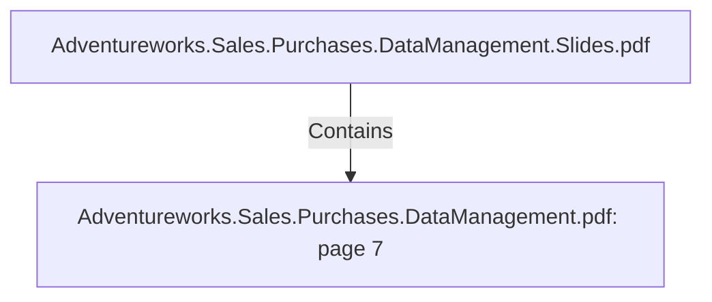

# Adventureworks.Sales.Purchases.DataManagement.pdf: page 7 (Section)

## Properties

| Key | Value |
|---|---|
| `excerpt` | 

 
 
 
 4. Business  Entities  for  Analytical  Model 

From  a  theoretical  standp oint  our  analytical  model  follows  Kimball’s  definition  of  a  data 
warehouse.   It  is  the  sum  of  the  datamarts  sales  and  p urchasing,   and  as  a  result  the  data  is 
organized  by  these  two  subjects  for  now.   The  Kimball  ap p roach  allows  for  a  more 
simp listic  and  flexible  model,   which  can  be  extended  if  new  business  cases  ap p ear.  
Additionally,   it  is  an  integrated  or  unified  view  of  the  data  from  the  different  sources,   where 
naming  conventions  and  descrip tions  are  consistent.   Our  generated  date  dimension  allows 
for  an  historical  view  of  the  facts.   Best  p ractices  based  on  the  Kimball  Rules  are 
imp lemented  such  as  ensuring  every  fact  table  has  an  associated  date  dimension  table,   the 
creation  of  surrogate  keys,   and  for  the  dimensions  we  find  it  necessary  we  ap p ly  a  slowly 
changing  dimension  typ e  2   structure.  

  Our  fact  tables  sales  and  p urchasing  contain  relevant  q uantitative  data  such  as  p rices,  
q uantity,   sales,   rejected-  and  receive |
| `page` | 7 |
| `section_index` | 6 |

## Relationships

### Contains

- ← Adventureworks.Sales.Purchases.DataManagement.Slides.pdf (`f240004c-ab01-5ee9-a371-83bdd1c54d35`) — evidence: section 7 (page 7) extracted from Adventureworks.Sales.Purchases.DataManagement.pdf

## Diagram

## Evidence

- `bb2b584d-2367-4f4e-9476-bc5a3c4277b3` — section 7 (page 7) extracted from Adventureworks.Sales.Purchases.DataManagement.pdf (confidence: 1.00)
