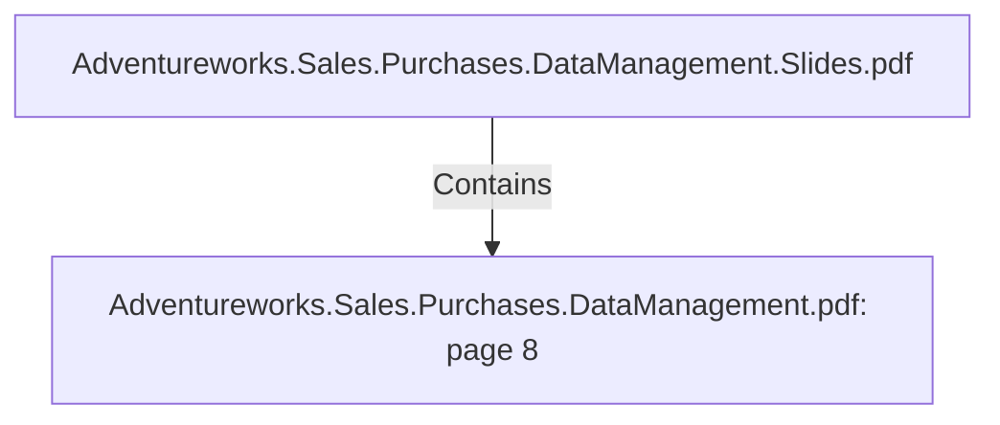

# Adventureworks.Sales.Purchases.DataManagement.pdf: page 8 (Section)

## Properties

| Key | Value |
|---|---|
| `excerpt` | 

 
 
 
  

In  the  following  sections  are  detailed  each  of  the  tables  from  the  Sales  &  Purchasing  Data 
Marts.    
   

  |
| `page` | 8 |
| `section_index` | 7 |

## Relationships

### Contains

- ← Adventureworks.Sales.Purchases.DataManagement.Slides.pdf (`f240004c-ab01-5ee9-a371-83bdd1c54d35`) — evidence: section 8 (page 8) extracted from Adventureworks.Sales.Purchases.DataManagement.pdf

## Diagram

## Evidence

- `06d9d0e6-1d6d-4388-b766-00fbdc92e555` — section 8 (page 8) extracted from Adventureworks.Sales.Purchases.DataManagement.pdf (confidence: 1.00)
