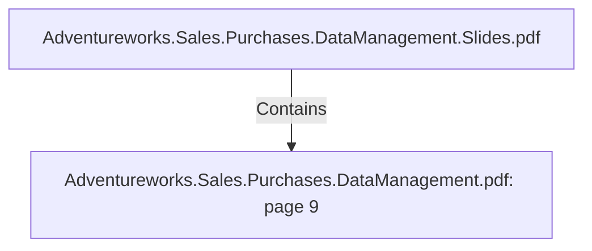

# Adventureworks.Sales.Purchases.DataManagement.pdf: page 9 (Section)

## Properties

| Key | Value |
|---|---|
| `excerpt` | 

 
 
 
 5. Product 

Product  Dimension   

The  p roduct  dimension  has  been  de-normalized  to  contain  Product  Line,   Product  Category,  
Subcategory  and  Product  Model.   The  p urp ose  is  to  be  able  to  filter  the  facts  on  p roducts,  
subcategory,   or  models.   This  dimension  combined  with  other  dimensions  and  facts  will 
allow  us  to  answer  business  challenges  2 ,   3   and  5 :   Create  top   5   p roducts  sales  ranking  by 
seasons;   create  top   5   p roducts  p rofit  ranking,   q uarter  by  q uarter;   see  in  a  single  view  sold 
items  vs  p urchased  items  for  each  p roduct  category.  

Product  Dimension  is  a  slowly  changing  dimension  typ e  2 ,   where  its  history  is  kep t  by 
versioning  each  row  and  assigning  an  effective  date  range  by  the  ETL  p rocess.  

Product  Data  Dictionary 

 
 Table  Name  dim_p roduct 

C o l umn  N a me   K e y?  Typ e   D e sc ri p ti o n   So urc e  

dim_ p ro duct_ id  Yes  INTEG
ER 
 This is the Surro ga te 
key  fo r the Pro duct 
Dimen sio n . This is 
p a rticula rly  imp o rta n t 
b eca use it is a  SCD 
Ty p e 2  
 Generated in the mySql DB 
using the add s |
| `page` | 9 |
| `section_index` | 8 |

## Relationships

### Contains

- ← Adventureworks.Sales.Purchases.DataManagement.Slides.pdf (`f240004c-ab01-5ee9-a371-83bdd1c54d35`) — evidence: section 9 (page 9) extracted from Adventureworks.Sales.Purchases.DataManagement.pdf

## Diagram

## Evidence

- `b8454d4d-b7bd-496f-9b74-df6b0b46cab3` — section 9 (page 9) extracted from Adventureworks.Sales.Purchases.DataManagement.pdf (confidence: 1.00)
