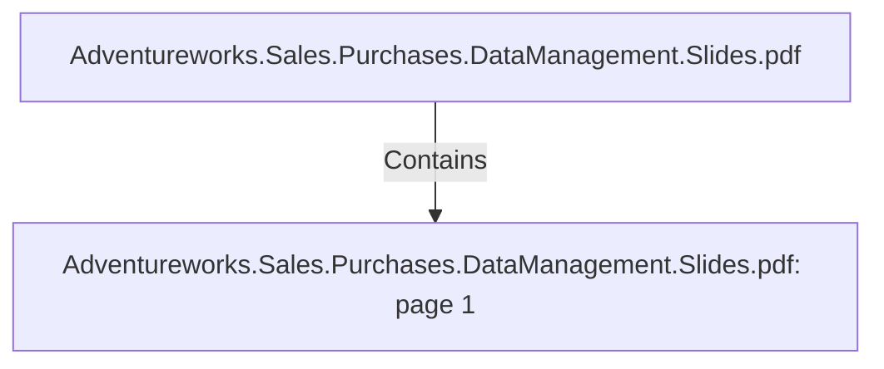

# Adventureworks.Sales.Purchases.DataManagement.Slides.pdf: page 1 (Section)

## Properties

| Key | Value |
|---|---|
| `excerpt` | 

EAE Data Management 2020 

Adrian Hagen
Jon Dale
Mohamed Ashmawy
Mostafa Abdelhakim
Joseph Higaki

ANALYTICS FOR 
ADVENTUREWORKS |
| `page` | 1 |
| `section_index` | 0 |

## Relationships

### Contains

- ← Adventureworks.Sales.Purchases.DataManagement.Slides.pdf (`f240004c-ab01-5ee9-a371-83bdd1c54d35`) — evidence: section 1 (page 1) extracted from Adventureworks.Sales.Purchases.DataManagement.Slides.pdf

## Diagram

## Evidence

- `71e72410-9ad7-4378-a389-be2df5fc383e` — section 1 (page 1) extracted from Adventureworks.Sales.Purchases.DataManagement.Slides.pdf (confidence: 1.00)
