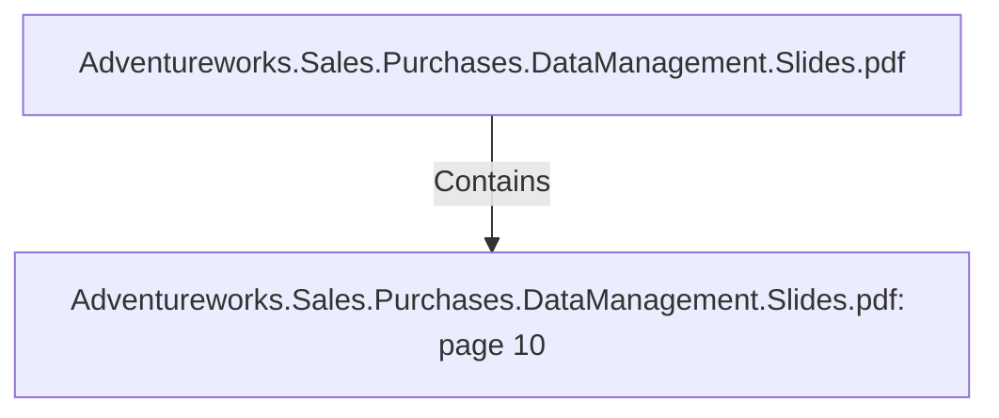

# Adventureworks.Sales.Purchases.DataManagement.Slides.pdf: page 10 (Section)

## Properties

| Key | Value |
|---|---|
| `excerpt` | 

PRODUCT TRANSFORMATION HIGHLIGHTS

SDC TYPE #2

Using Dimension 
lookup/update component |
| `page` | 10 |
| `section_index` | 9 |

## Relationships

### Contains

- ← Adventureworks.Sales.Purchases.DataManagement.Slides.pdf (`f240004c-ab01-5ee9-a371-83bdd1c54d35`) — evidence: section 10 (page 10) extracted from Adventureworks.Sales.Purchases.DataManagement.Slides.pdf

## Diagram

## Evidence

- `18705560-842a-4d35-a084-75b945a5104c` — section 10 (page 10) extracted from Adventureworks.Sales.Purchases.DataManagement.Slides.pdf (confidence: 1.00)
