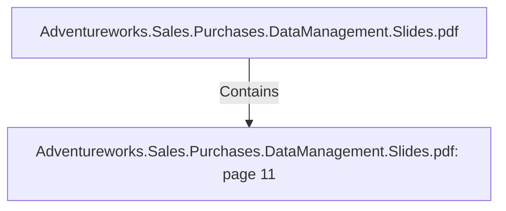

# Adventureworks.Sales.Purchases.DataManagement.Slides.pdf: page 11 (Section)

## Properties

| Key | Value |
|---|---|
| `excerpt` | 

PRODUCT TRANSFORMATION HIGHLIGHTS

INITIAL STATE OF PRODUCT |
| `page` | 11 |
| `section_index` | 10 |

## Relationships

### Contains

- ← Adventureworks.Sales.Purchases.DataManagement.Slides.pdf (`f240004c-ab01-5ee9-a371-83bdd1c54d35`) — evidence: section 11 (page 11) extracted from Adventureworks.Sales.Purchases.DataManagement.Slides.pdf

## Diagram

## Evidence

- `79e5d81f-f77a-4156-8b79-5600739da430` — section 11 (page 11) extracted from Adventureworks.Sales.Purchases.DataManagement.Slides.pdf (confidence: 1.00)
