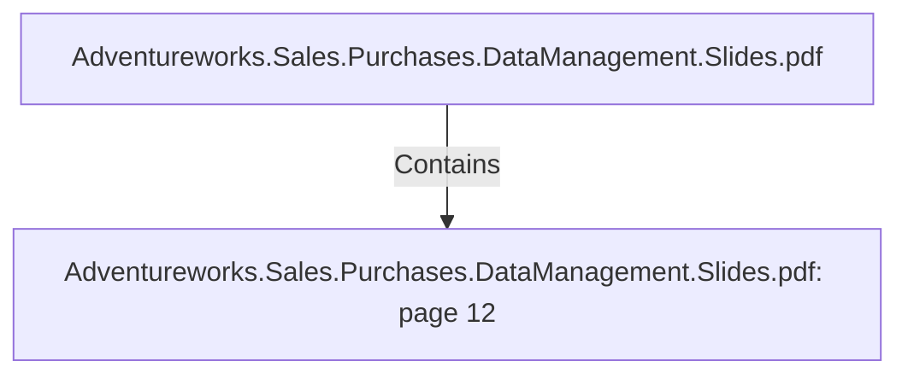

# Adventureworks.Sales.Purchases.DataManagement.Slides.pdf: page 12 (Section)

## Properties

| Key | Value |
|---|---|
| `excerpt` | 

PRODUCT TRANSFORMATION HIGHLIGHTS

NAME CHANGED AT 
TRANSACTIONAL DATABASE |
| `page` | 12 |
| `section_index` | 11 |

## Relationships

### Contains

- ← Adventureworks.Sales.Purchases.DataManagement.Slides.pdf (`f240004c-ab01-5ee9-a371-83bdd1c54d35`) — evidence: section 12 (page 12) extracted from Adventureworks.Sales.Purchases.DataManagement.Slides.pdf

## Diagram

## Evidence

- `197086c6-830e-46b6-af32-d0fc25afeb37` — section 12 (page 12) extracted from Adventureworks.Sales.Purchases.DataManagement.Slides.pdf (confidence: 1.00)
