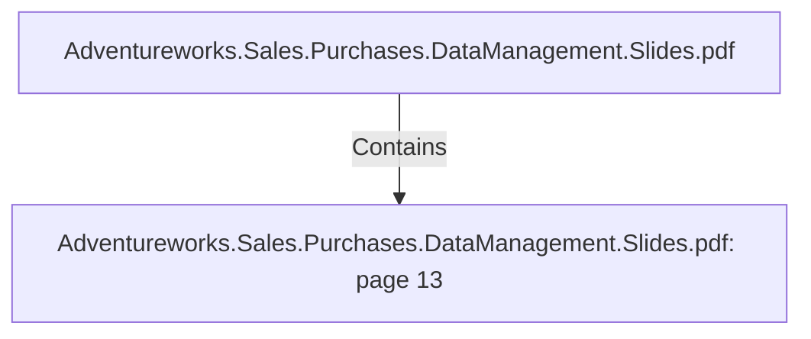

# Adventureworks.Sales.Purchases.DataManagement.Slides.pdf: page 13 (Section)

## Properties

| Key | Value |
|---|---|
| `excerpt` | 

PRODUCT TRANSFORMATION HIGHLIGHTS

1 OUTPUT, INSERT DETECTED |
| `page` | 13 |
| `section_index` | 12 |

## Relationships

### Contains

- ← Adventureworks.Sales.Purchases.DataManagement.Slides.pdf (`f240004c-ab01-5ee9-a371-83bdd1c54d35`) — evidence: section 13 (page 13) extracted from Adventureworks.Sales.Purchases.DataManagement.Slides.pdf

## Diagram

## Evidence

- `ff5ecc70-280c-473a-bdf4-b818a4909a67` — section 13 (page 13) extracted from Adventureworks.Sales.Purchases.DataManagement.Slides.pdf (confidence: 1.00)
