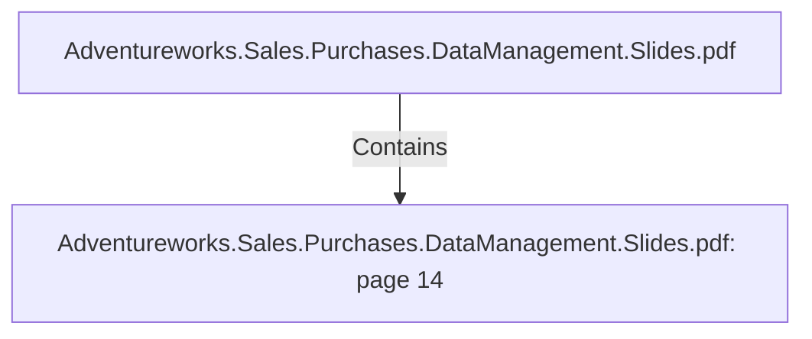

# Adventureworks.Sales.Purchases.DataManagement.Slides.pdf: page 14 (Section)

## Properties

| Key | Value |
|---|---|
| `excerpt` | 

PRODUCT TRANSFORMATION HIGHLIGHTS

PRODUCT SECOND VERSION |
| `page` | 14 |
| `section_index` | 13 |

## Relationships

### Contains

- ← Adventureworks.Sales.Purchases.DataManagement.Slides.pdf (`f240004c-ab01-5ee9-a371-83bdd1c54d35`) — evidence: section 14 (page 14) extracted from Adventureworks.Sales.Purchases.DataManagement.Slides.pdf

## Diagram

## Evidence

- `65354121-0167-42d7-8816-f74466b34bd1` — section 14 (page 14) extracted from Adventureworks.Sales.Purchases.DataManagement.Slides.pdf (confidence: 1.00)
