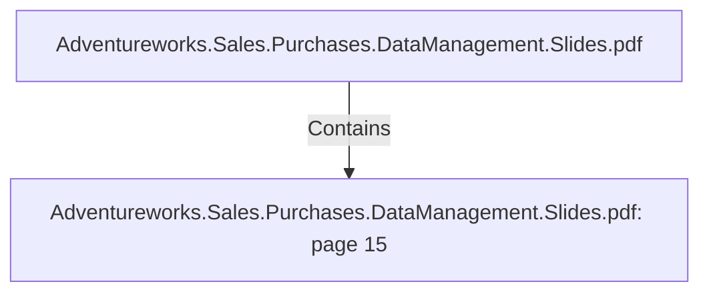

# Adventureworks.Sales.Purchases.DataManagement.Slides.pdf: page 15 (Section)

## Properties

| Key | Value |
|---|---|
| `excerpt` | 

DATE DIMENSION HIGHLIGHTS

Column Name Key? Description Source

dim_date_id Yes
 This is the surrogate key
It is an integer with the following 
format:
20201214
 Generated in a staging database, that lists days in 
a datarange
YEAR * 10,000 + MONTH * 100 + DAY

is_holiday No Flag indicating if it is a holiday or not Holiday data is exrtracted via an API from

https://date.nager.at/api/v2/publicholidays/2020/es

holiday_name No National HOliday name for Spain Holiday data is exrtracted via an API from

https://date.nager.at/api/v2/publicholidays/2020/es

date No Represents the day of the row, in a 
date dabase field Generated in a staging database, that lists days in 
a datarange

northern_hemisphere_seaso
n No Season text in english for the 
northern hemisphere text: (Winter, 
Autum, Summer, Fall) Calculated from a csv source

southern_hemisphere_seaso
n No Season text in english for the 
southern hemisphere text: (Winter, 
Autum, Summer, Fall) Calculated from a csv source |
| `page` | 15 |
| `section_index` | 14 |

## Relationships

### Contains

- ← Adventureworks.Sales.Purchases.DataManagement.Slides.pdf (`f240004c-ab01-5ee9-a371-83bdd1c54d35`) — evidence: section 15 (page 15) extracted from Adventureworks.Sales.Purchases.DataManagement.Slides.pdf

## Diagram

## Evidence

- `68140fd8-98df-4bbb-adca-ce175d1e4186` — section 15 (page 15) extracted from Adventureworks.Sales.Purchases.DataManagement.Slides.pdf (confidence: 1.00)
