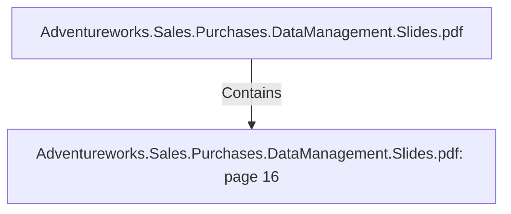

# Adventureworks.Sales.Purchases.DataManagement.Slides.pdf: page 16 (Section)

## Properties

| Key | Value |
|---|---|
| `excerpt` | 

DATE TRANSFORMATION HIGHLIGHTS

DATE-RANGE AT 
MySQL STAGING 
DATABASE |
| `page` | 16 |
| `section_index` | 15 |

## Relationships

### Contains

- ← Adventureworks.Sales.Purchases.DataManagement.Slides.pdf (`f240004c-ab01-5ee9-a371-83bdd1c54d35`) — evidence: section 16 (page 16) extracted from Adventureworks.Sales.Purchases.DataManagement.Slides.pdf

## Diagram

## Evidence

- `a56ca72d-ae82-492c-9e71-038693036ee9` — section 16 (page 16) extracted from Adventureworks.Sales.Purchases.DataManagement.Slides.pdf (confidence: 1.00)
