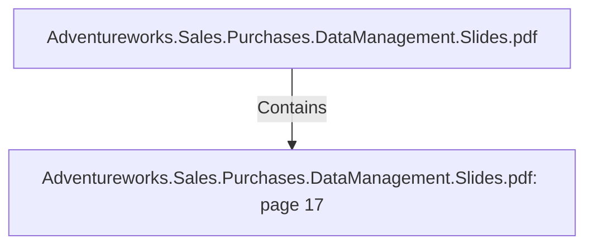

# Adventureworks.Sales.Purchases.DataManagement.Slides.pdf: page 17 (Section)

## Properties

| Key | Value |
|---|---|
| `excerpt` | 

DATE TRANSFORMATION HIGHLIGHTS

HOLIDAY API
BY YEAR |
| `page` | 17 |
| `section_index` | 16 |

## Relationships

### Contains

- ← Adventureworks.Sales.Purchases.DataManagement.Slides.pdf (`f240004c-ab01-5ee9-a371-83bdd1c54d35`) — evidence: section 17 (page 17) extracted from Adventureworks.Sales.Purchases.DataManagement.Slides.pdf

## Diagram

## Evidence

- `8bbc5bd7-dc6e-475c-8312-4177a5d2091a` — section 17 (page 17) extracted from Adventureworks.Sales.Purchases.DataManagement.Slides.pdf (confidence: 1.00)
