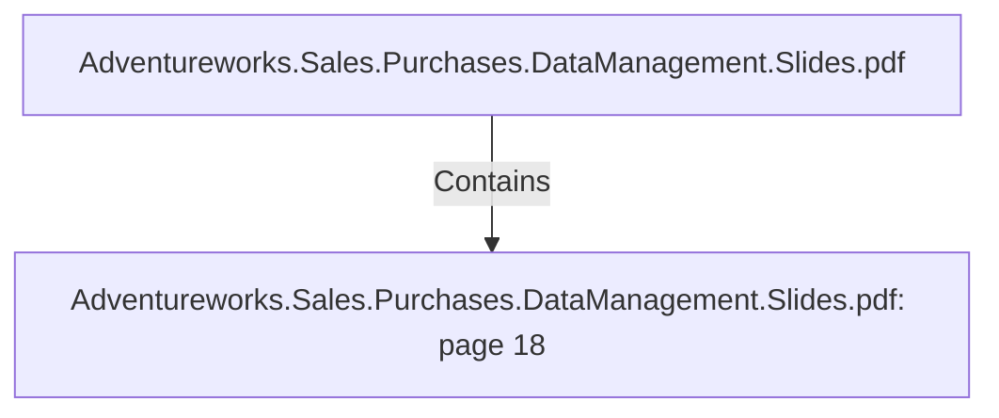

# Adventureworks.Sales.Purchases.DataManagement.Slides.pdf: page 18 (Section)

## Properties

| Key | Value |
|---|---|
| `excerpt` | 

DATE TRANSFORMATION HIGHLIGHTS |
| `page` | 18 |
| `section_index` | 17 |

## Relationships

### Contains

- ← Adventureworks.Sales.Purchases.DataManagement.Slides.pdf (`f240004c-ab01-5ee9-a371-83bdd1c54d35`) — evidence: section 18 (page 18) extracted from Adventureworks.Sales.Purchases.DataManagement.Slides.pdf

## Diagram

## Evidence

- `81a19995-0e6f-4e81-b1ee-8375cac056f9` — section 18 (page 18) extracted from Adventureworks.Sales.Purchases.DataManagement.Slides.pdf (confidence: 1.00)
