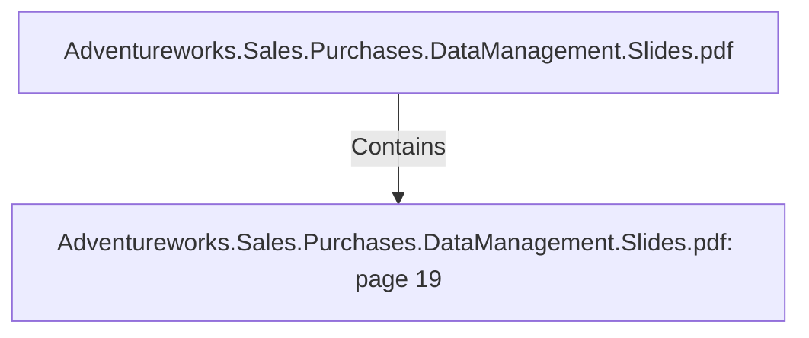

# Adventureworks.Sales.Purchases.DataManagement.Slides.pdf: page 19 (Section)

## Properties

| Key | Value |
|---|---|
| `excerpt` | 

PURCHASES FACT HIGHLIGHTS |
| `page` | 19 |
| `section_index` | 18 |

## Relationships

### Contains

- ← Adventureworks.Sales.Purchases.DataManagement.Slides.pdf (`f240004c-ab01-5ee9-a371-83bdd1c54d35`) — evidence: section 19 (page 19) extracted from Adventureworks.Sales.Purchases.DataManagement.Slides.pdf

## Diagram

## Evidence

- `2e0f37fb-b901-42fa-9cda-938c4e629ce0` — section 19 (page 19) extracted from Adventureworks.Sales.Purchases.DataManagement.Slides.pdf (confidence: 1.00)
