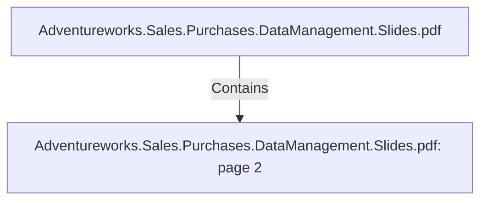

# Adventureworks.Sales.Purchases.DataManagement.Slides.pdf: page 2 (Section)

## Properties

| Key | Value |
|---|---|
| `excerpt` | 

OVERVIEW

ADVENTUREWORKS CYCLES NEEDS 
INSIGHTS TO IMPROVE COMPANY’S

OVERALL BUSINESS PERFORMANCE |
| `page` | 2 |
| `section_index` | 1 |

## Relationships

### Contains

- ← Adventureworks.Sales.Purchases.DataManagement.Slides.pdf (`f240004c-ab01-5ee9-a371-83bdd1c54d35`) — evidence: section 2 (page 2) extracted from Adventureworks.Sales.Purchases.DataManagement.Slides.pdf

## Diagram

## Evidence

- `458ab9dd-3582-4e4c-b9a6-acfe55bf6cfe` — section 2 (page 2) extracted from Adventureworks.Sales.Purchases.DataManagement.Slides.pdf (confidence: 1.00)
