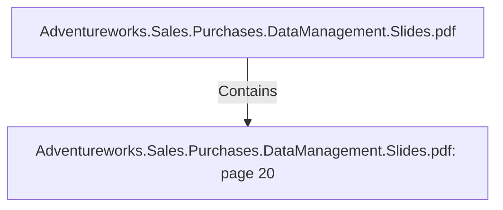

# Adventureworks.Sales.Purchases.DataManagement.Slides.pdf: page 20 (Section)

## Properties

| Key | Value |
|---|---|
| `excerpt` | 

PURCHASES TRANSFORMATION 
HIGHLIGHTS |
| `page` | 20 |
| `section_index` | 19 |

## Relationships

### Contains

- ← Adventureworks.Sales.Purchases.DataManagement.Slides.pdf (`f240004c-ab01-5ee9-a371-83bdd1c54d35`) — evidence: section 20 (page 20) extracted from Adventureworks.Sales.Purchases.DataManagement.Slides.pdf

## Diagram

## Evidence

- `00ca1bac-bce4-4f3c-94fc-42bc0ad3621a` — section 20 (page 20) extracted from Adventureworks.Sales.Purchases.DataManagement.Slides.pdf (confidence: 1.00)
