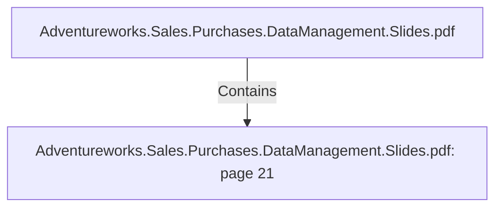

# Adventureworks.Sales.Purchases.DataManagement.Slides.pdf: page 21 (Section)

## Properties

| Key | Value |
|---|---|
| `excerpt` | 

PURCHASES FACT HIGHLIGHTS |
| `page` | 21 |
| `section_index` | 20 |

## Relationships

### Contains

- ← Adventureworks.Sales.Purchases.DataManagement.Slides.pdf (`f240004c-ab01-5ee9-a371-83bdd1c54d35`) — evidence: section 21 (page 21) extracted from Adventureworks.Sales.Purchases.DataManagement.Slides.pdf

## Diagram

## Evidence

- `c6e12963-f4b2-4258-a678-fb0f02c917a7` — section 21 (page 21) extracted from Adventureworks.Sales.Purchases.DataManagement.Slides.pdf (confidence: 1.00)
