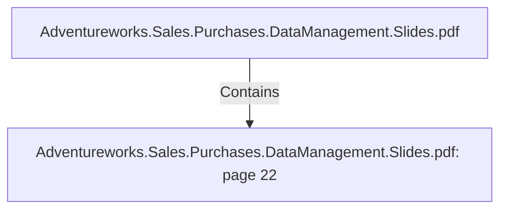

# Adventureworks.Sales.Purchases.DataManagement.Slides.pdf: page 22 (Section)

## Properties

| Key | Value |
|---|---|
| `excerpt` | 

SALES FACT HIGHLIGHTS

Column Name Key
? Description Source

fact_sales_id Yes Surrogate key Generated by “Add sequence” 
in Kettle

product_standard_c
ost_on_day No The standard cost for 
the product that day Calculated in Kettle

sales_profit No Profit of sale Calculated in Kettle |
| `page` | 22 |
| `section_index` | 21 |

## Relationships

### Contains

- ← Adventureworks.Sales.Purchases.DataManagement.Slides.pdf (`f240004c-ab01-5ee9-a371-83bdd1c54d35`) — evidence: section 22 (page 22) extracted from Adventureworks.Sales.Purchases.DataManagement.Slides.pdf

## Diagram

## Evidence

- `64077130-a98e-4e99-bb00-46e4ddc73615` — section 22 (page 22) extracted from Adventureworks.Sales.Purchases.DataManagement.Slides.pdf (confidence: 1.00)
