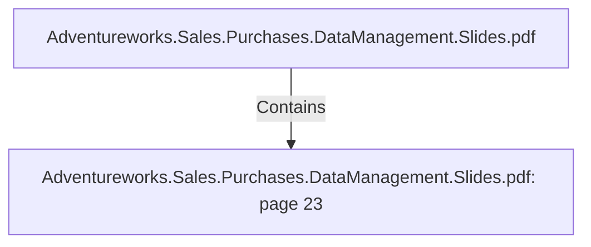

# Adventureworks.Sales.Purchases.DataManagement.Slides.pdf: page 23 (Section)

## Properties

| Key | Value |
|---|---|
| `excerpt` | 

SALES TRANSFORMATION HIGHLIGHTS |
| `page` | 23 |
| `section_index` | 22 |

## Relationships

### Contains

- ← Adventureworks.Sales.Purchases.DataManagement.Slides.pdf (`f240004c-ab01-5ee9-a371-83bdd1c54d35`) — evidence: section 23 (page 23) extracted from Adventureworks.Sales.Purchases.DataManagement.Slides.pdf

## Diagram

## Evidence

- `83d3b644-e32b-4318-9860-b10c64d30e4e` — section 23 (page 23) extracted from Adventureworks.Sales.Purchases.DataManagement.Slides.pdf (confidence: 1.00)
