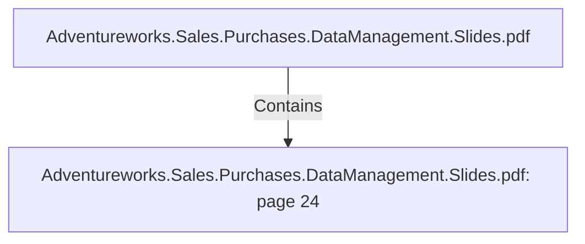

# Adventureworks.Sales.Purchases.DataManagement.Slides.pdf: page 24 (Section)

## Properties

| Key | Value |
|---|---|
| `excerpt` | 

SALES FACT HIGHLIGHTS

Product 
Standard 
Cost |
| `page` | 24 |
| `section_index` | 23 |

## Relationships

### Contains

- ← Adventureworks.Sales.Purchases.DataManagement.Slides.pdf (`f240004c-ab01-5ee9-a371-83bdd1c54d35`) — evidence: section 24 (page 24) extracted from Adventureworks.Sales.Purchases.DataManagement.Slides.pdf

## Diagram

## Evidence

- `d73a25ca-d4a0-4257-9cc8-292e4e0ca02e` — section 24 (page 24) extracted from Adventureworks.Sales.Purchases.DataManagement.Slides.pdf (confidence: 1.00)
