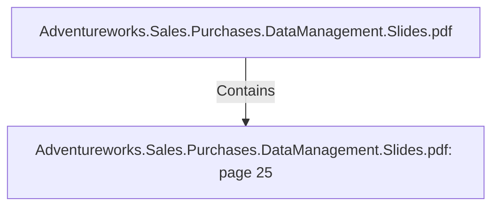

# Adventureworks.Sales.Purchases.DataManagement.Slides.pdf: page 25 (Section)

## Properties

| Key | Value |
|---|---|
| `excerpt` | 
JOBSDIMENSIONS
 FACTS |
| `page` | 25 |
| `section_index` | 24 |

## Relationships

### Contains

- ← Adventureworks.Sales.Purchases.DataManagement.Slides.pdf (`f240004c-ab01-5ee9-a371-83bdd1c54d35`) — evidence: section 25 (page 25) extracted from Adventureworks.Sales.Purchases.DataManagement.Slides.pdf

## Diagram

## Evidence

- `7feb88e5-a6a2-4bcd-9880-0b74713a800a` — section 25 (page 25) extracted from Adventureworks.Sales.Purchases.DataManagement.Slides.pdf (confidence: 1.00)
