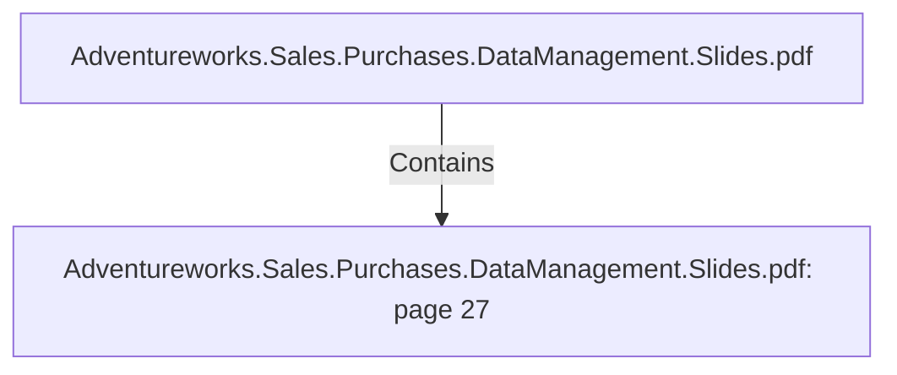

# Adventureworks.Sales.Purchases.DataManagement.Slides.pdf: page 27 (Section)

## Properties

| Key | Value |
|---|---|
| `excerpt` | 
HOLIDAY SALES
Reseller sales vs direct consumer sales 
over specific holiday days. |
| `page` | 27 |
| `section_index` | 26 |

## Relationships

### Contains

- ← Adventureworks.Sales.Purchases.DataManagement.Slides.pdf (`f240004c-ab01-5ee9-a371-83bdd1c54d35`) — evidence: section 27 (page 27) extracted from Adventureworks.Sales.Purchases.DataManagement.Slides.pdf

## Diagram

## Evidence

- `407c83ae-e31e-40c8-9e45-2a736ecad033` — section 27 (page 27) extracted from Adventureworks.Sales.Purchases.DataManagement.Slides.pdf (confidence: 1.00)
