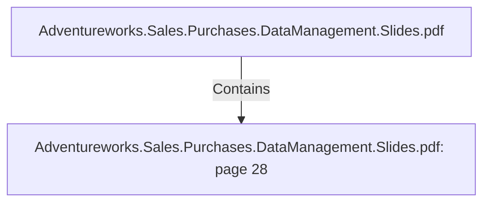

# Adventureworks.Sales.Purchases.DataManagement.Slides.pdf: page 28 (Section)

## Properties

| Key | Value |
|---|---|
| `excerpt` | 
PRODUCT PROFITABILITY
Create top 5 products profit 
ranking, quarter by quarter |
| `page` | 28 |
| `section_index` | 27 |

## Relationships

### Contains

- ← Adventureworks.Sales.Purchases.DataManagement.Slides.pdf (`f240004c-ab01-5ee9-a371-83bdd1c54d35`) — evidence: section 28 (page 28) extracted from Adventureworks.Sales.Purchases.DataManagement.Slides.pdf

## Diagram

## Evidence

- `8bcae912-9db2-47fb-8d68-65bab9630891` — section 28 (page 28) extracted from Adventureworks.Sales.Purchases.DataManagement.Slides.pdf (confidence: 1.00)
