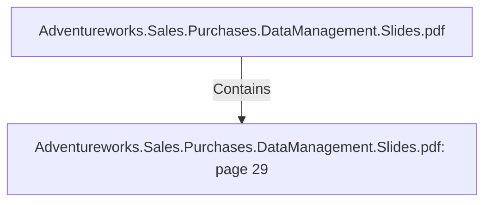

# Adventureworks.Sales.Purchases.DataManagement.Slides.pdf: page 29 (Section)

## Properties

| Key | Value |
|---|---|
| `excerpt` | 
REJECTED ITEMS
Create a top 5 Vendor ranking of 
rejected items on purchase orders.  |
| `page` | 29 |
| `section_index` | 28 |

## Relationships

### Contains

- ← Adventureworks.Sales.Purchases.DataManagement.Slides.pdf (`f240004c-ab01-5ee9-a371-83bdd1c54d35`) — evidence: section 29 (page 29) extracted from Adventureworks.Sales.Purchases.DataManagement.Slides.pdf

## Diagram

## Evidence

- `ddec853a-ca52-4468-8cf8-38e931780371` — section 29 (page 29) extracted from Adventureworks.Sales.Purchases.DataManagement.Slides.pdf (confidence: 1.00)
