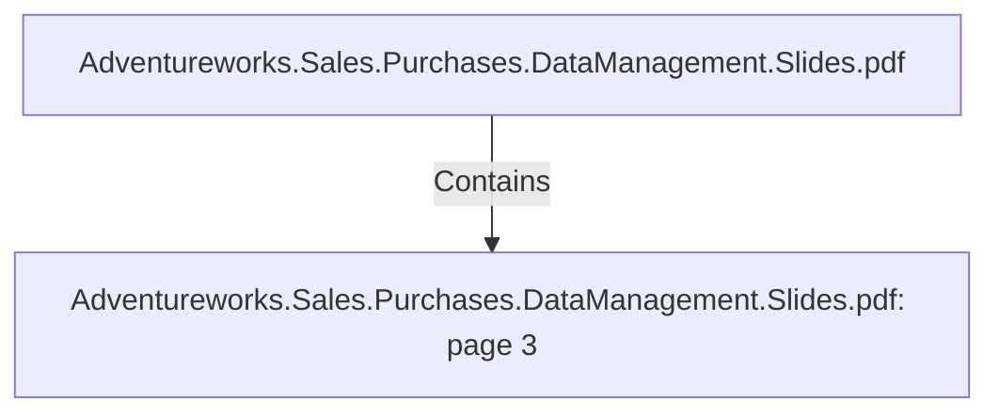

# Adventureworks.Sales.Purchases.DataManagement.Slides.pdf: page 3 (Section)

## Properties

| Key | Value |
|---|---|
| `excerpt` | 

SCOPE

ANALYTICS WILL FOCUS FIRST IN
SALES AND PURCHASING 
TO DRIVE IMPROVEMENTS IN 
KEY FINANCIAL PERFORMANCE INDICATORS |
| `page` | 3 |
| `section_index` | 2 |

## Relationships

### Contains

- ← Adventureworks.Sales.Purchases.DataManagement.Slides.pdf (`f240004c-ab01-5ee9-a371-83bdd1c54d35`) — evidence: section 3 (page 3) extracted from Adventureworks.Sales.Purchases.DataManagement.Slides.pdf

## Diagram

## Evidence

- `28219189-84c8-4932-a9c1-c541956b1858` — section 3 (page 3) extracted from Adventureworks.Sales.Purchases.DataManagement.Slides.pdf (confidence: 1.00)
