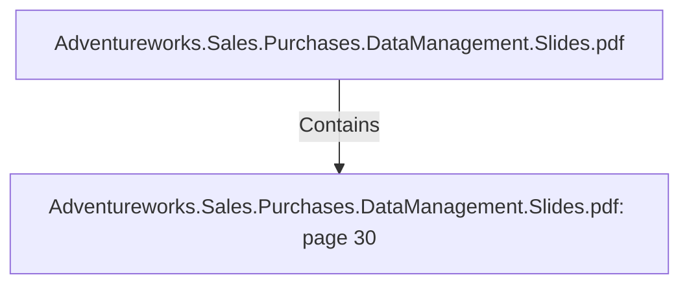

# Adventureworks.Sales.Purchases.DataManagement.Slides.pdf: page 30 (Section)

## Properties

| Key | Value |
|---|---|
| `excerpt` | 

PURCHASED VS SOLD
Sold items vs purchased items, 
for each product category

2011
 2013 |
| `page` | 30 |
| `section_index` | 29 |

## Relationships

### Contains

- ← Adventureworks.Sales.Purchases.DataManagement.Slides.pdf (`f240004c-ab01-5ee9-a371-83bdd1c54d35`) — evidence: section 30 (page 30) extracted from Adventureworks.Sales.Purchases.DataManagement.Slides.pdf

## Diagram

## Evidence

- `3cf6adf9-e583-4254-9e99-b18f78b3d58c` — section 30 (page 30) extracted from Adventureworks.Sales.Purchases.DataManagement.Slides.pdf (confidence: 1.00)
