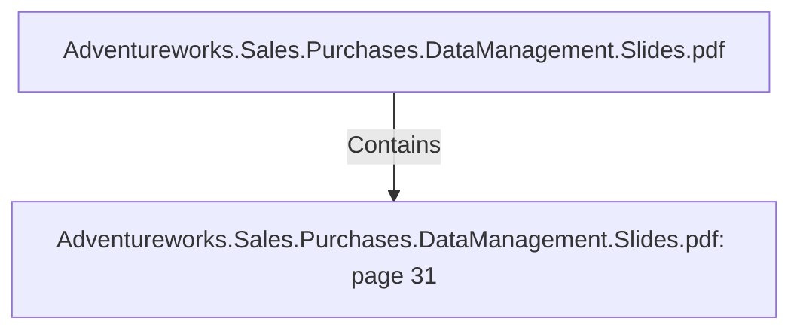

# Adventureworks.Sales.Purchases.DataManagement.Slides.pdf: page 31 (Section)

## Properties

| Key | Value |
|---|---|
| `excerpt` |  |
| `page` | 31 |
| `section_index` | 30 |

## Relationships

### Contains

- ← Adventureworks.Sales.Purchases.DataManagement.Slides.pdf (`f240004c-ab01-5ee9-a371-83bdd1c54d35`) — evidence: section 31 (page 31) extracted from Adventureworks.Sales.Purchases.DataManagement.Slides.pdf

## Diagram

## Evidence

- `0ffb224b-7b60-443d-a683-e3e3b823dacf` — section 31 (page 31) extracted from Adventureworks.Sales.Purchases.DataManagement.Slides.pdf (confidence: 1.00)
