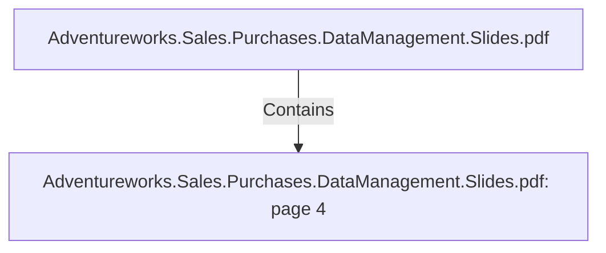

# Adventureworks.Sales.Purchases.DataManagement.Slides.pdf: page 4 (Section)

## Properties

| Key | Value |
|---|---|
| `excerpt` | 

BUSINESS CHALLENGES / INSIGHTS

HOLIDAY SALES
Reseller sales vs direct 
consumer sales over 
specific holiday days.
 SEASONAL SALES

Create top 5 products sales 
ranking by seasons.
 PRODUCT PROFITABILITY
Create top 5 products profit 
ranking, quarter by quarter

REJECTED ITEMS
Create a top 5 Vendor 
ranking of rejected items 
on purchase orders. 
 PURCHASED VS SOLD
Sold items vs purchased 
items, for each product 
category |
| `page` | 4 |
| `section_index` | 3 |

## Relationships

### Contains

- ← Adventureworks.Sales.Purchases.DataManagement.Slides.pdf (`f240004c-ab01-5ee9-a371-83bdd1c54d35`) — evidence: section 4 (page 4) extracted from Adventureworks.Sales.Purchases.DataManagement.Slides.pdf

## Diagram

## Evidence

- `33dd4b4a-c87a-4f1a-a85e-b1d6ea38f0fa` — section 4 (page 4) extracted from Adventureworks.Sales.Purchases.DataManagement.Slides.pdf (confidence: 1.00)
