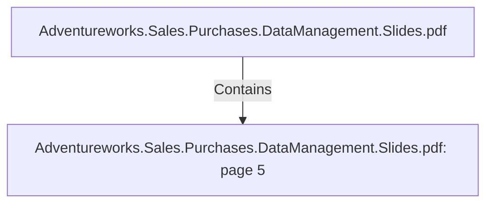

# Adventureworks.Sales.Purchases.DataManagement.Slides.pdf: page 5 (Section)

## Properties

| Key | Value |
|---|---|
| `excerpt` | 

ARCHITECTURE |
| `page` | 5 |
| `section_index` | 4 |

## Relationships

### Contains

- ← Adventureworks.Sales.Purchases.DataManagement.Slides.pdf (`f240004c-ab01-5ee9-a371-83bdd1c54d35`) — evidence: section 5 (page 5) extracted from Adventureworks.Sales.Purchases.DataManagement.Slides.pdf

## Diagram

## Evidence

- `582e7524-4f1f-4f04-b9c2-3b8d135726dd` — section 5 (page 5) extracted from Adventureworks.Sales.Purchases.DataManagement.Slides.pdf (confidence: 1.00)
