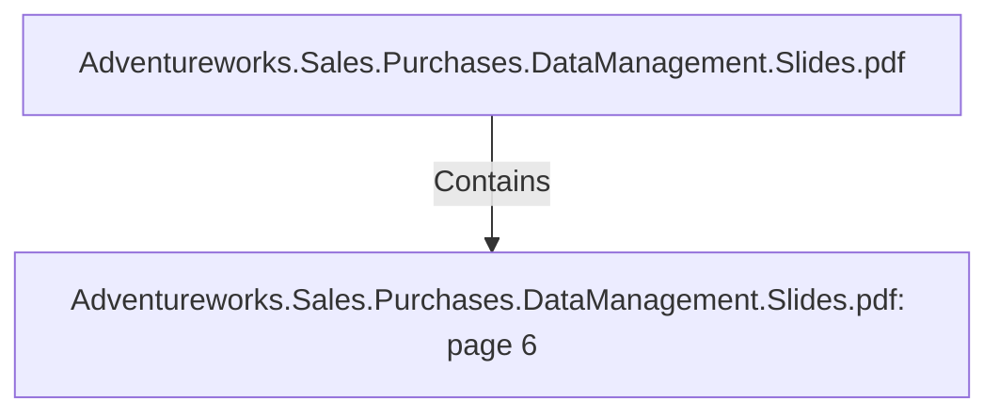

# Adventureworks.Sales.Purchases.DataManagement.Slides.pdf: page 6 (Section)

## Properties

| Key | Value |
|---|---|
| `excerpt` | 

SALES
DATA MART |
| `page` | 6 |
| `section_index` | 5 |

## Relationships

### Contains

- ← Adventureworks.Sales.Purchases.DataManagement.Slides.pdf (`f240004c-ab01-5ee9-a371-83bdd1c54d35`) — evidence: section 6 (page 6) extracted from Adventureworks.Sales.Purchases.DataManagement.Slides.pdf

## Diagram

## Evidence

- `75dc75b3-ac8e-4f38-8077-2dce8181f190` — section 6 (page 6) extracted from Adventureworks.Sales.Purchases.DataManagement.Slides.pdf (confidence: 1.00)
