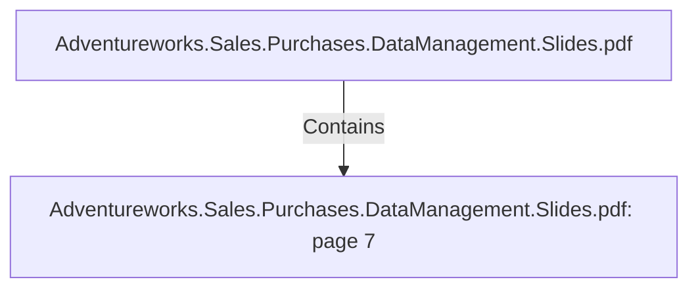

# Adventureworks.Sales.Purchases.DataManagement.Slides.pdf: page 7 (Section)

## Properties

| Key | Value |
|---|---|
| `excerpt` | 

PURCHASING
DATA MART |
| `page` | 7 |
| `section_index` | 6 |

## Relationships

### Contains

- ← Adventureworks.Sales.Purchases.DataManagement.Slides.pdf (`f240004c-ab01-5ee9-a371-83bdd1c54d35`) — evidence: section 7 (page 7) extracted from Adventureworks.Sales.Purchases.DataManagement.Slides.pdf

## Diagram

## Evidence

- `55990189-3d17-4888-b003-306dfb2949ee` — section 7 (page 7) extracted from Adventureworks.Sales.Purchases.DataManagement.Slides.pdf (confidence: 1.00)
