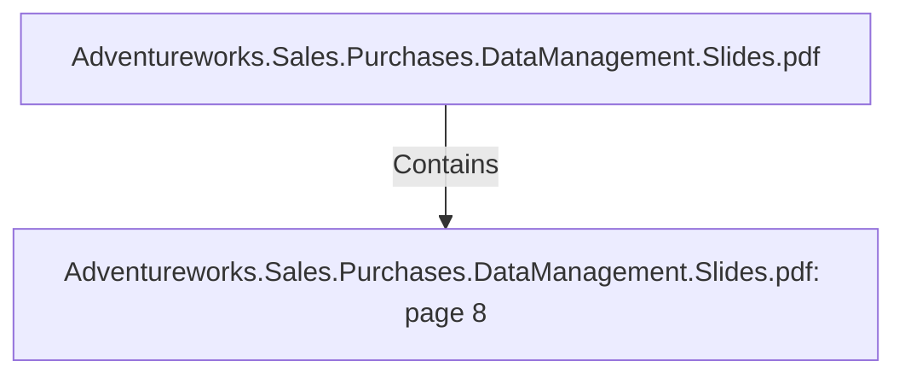

# Adventureworks.Sales.Purchases.DataManagement.Slides.pdf: page 8 (Section)

## Properties

| Key | Value |
|---|---|
| `excerpt` | 

ANALYTICAL 
MODEL |
| `page` | 8 |
| `section_index` | 7 |

## Relationships

### Contains

- ← Adventureworks.Sales.Purchases.DataManagement.Slides.pdf (`f240004c-ab01-5ee9-a371-83bdd1c54d35`) — evidence: section 8 (page 8) extracted from Adventureworks.Sales.Purchases.DataManagement.Slides.pdf

## Diagram

## Evidence

- `c5413618-ca6d-47cc-a61a-c281724b3ab5` — section 8 (page 8) extracted from Adventureworks.Sales.Purchases.DataManagement.Slides.pdf (confidence: 1.00)
