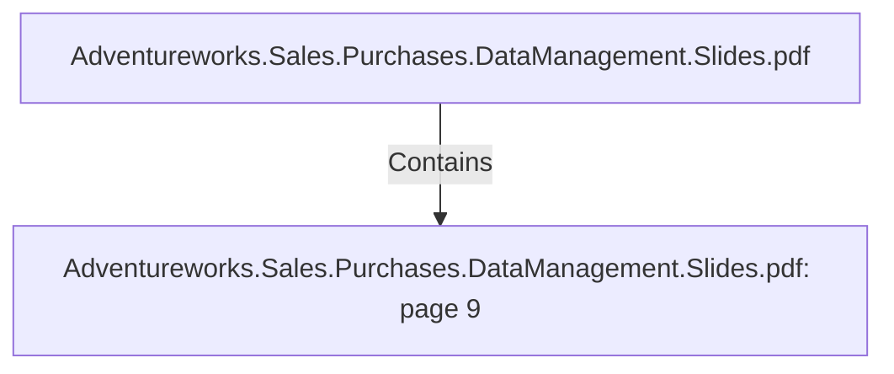

# Adventureworks.Sales.Purchases.DataManagement.Slides.pdf: page 9 (Section)

## Properties

| Key | Value |
|---|---|
| `excerpt` | 

PRODUCT DIMENSION HIGHLIGHTS

Column Name Key? Description Source

dim_product_id Yes Surrogate key Generated in the mySql DB using the 
add sequence feature in Kettle

product_id No ID for products
Primary key of transactional 
DB
 Extracted from AdventureWorks2019 
table Production.Product column 
ProductID

product_number No Product number Extracted from AdventureWorks2019 
table Production.Product column 
ProductNumber

start_date No Start effective date for the 
product version Calculated in Kettle, based on 
ADventureworks2019 changes

end_date No End effective date for the 
product version Calculated in Kettle, based on 
ADventureworks2019 changes

version_number No
 Version number 
representing the sequence 
where a product has 
changed in history, after the 
dimension first load
 Calculated in Kettle, based on 
ADventureworks2019 changes |
| `page` | 9 |
| `section_index` | 8 |

## Relationships

### Contains

- ← Adventureworks.Sales.Purchases.DataManagement.Slides.pdf (`f240004c-ab01-5ee9-a371-83bdd1c54d35`) — evidence: section 9 (page 9) extracted from Adventureworks.Sales.Purchases.DataManagement.Slides.pdf

## Diagram

## Evidence

- `126c55e5-2f10-4ef2-99e0-228676406f62` — section 9 (page 9) extracted from Adventureworks.Sales.Purchases.DataManagement.Slides.pdf (confidence: 1.00)
