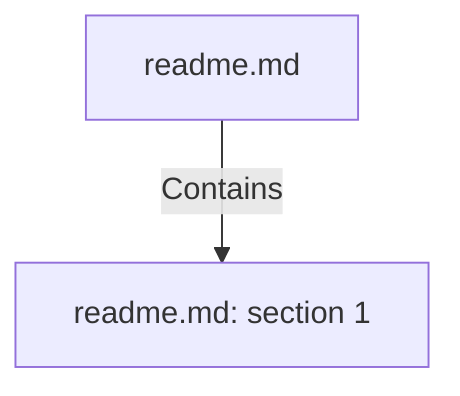

# readme.md: section 1 (Section)

## Properties

| Key | Value |
|---|---|
| `excerpt` | # Adventureworks_sales_purchases_datamart
This is the final assignment from the Data Management course from the Big Data &amp; Analytics Masters @ [EAE](https://www.eae.es/) class of 2021.
This project:
* Extracts data from the famous [Microsoft SQL](https://www.microsoft.com/en-us/sql-server) demo database [Adventureworks](https://docs.microsoft.com/en-us/sql/samples/adventureworks-install-configure?view=sql-server-ver15&tabs=ssms)
* Uses [Date Nager API](https://date.nager.at/) to specify holidays into the date dimension
* Uses a [simple weather csv](https://en.wikipedia.org/wiki/Season#Meteorological) to specify northern and southern hemisphere season into the date dimension
* Transforms the data  using  [Pentaho Kettle](https://community.hitachivantara.com/s/article/data-integration-kettle), as ETL tool
* Loads the data into [My SQL](https://www.mysql.com/) as RDBMS for the OLAP database of the Sales and Purchases datamarts

Professors:
* [Francesc Casado](https://www.linkedin.com/in/francesccasadopastor/)
* [Bruno Galván García](https://www.linkedin.com/in/brunogalvangarcia/)

Team: 

* Adrian Hagen
* [Jon Dale](https://www.linkedin.com/in/jon-kristian-dale-441034188/)
* [Moha |
| `page` | null |
| `section_index` | 0 |

## Relationships

### Contains

- ← readme.md (`99d9bffd-4207-5f81-93c3-1cc96f17a2f3`) — evidence: section 1 extracted from readme.md

## Diagram

## Evidence

- `540b1b7e-9eee-4969-bb7d-92d3b163e661` — section 1 extracted from readme.md (confidence: 1.00)
