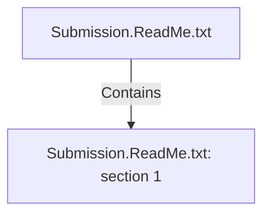

# Submission.ReadMe.txt: section 1 (Section)

## Properties

| Key | Value |
|---|---|
| `excerpt` | The document "Adventureworks.Sales.Purchases.DataManagement" was made in Google Docs and explain the work of our assignment. 
We published in both formats so that our teachers review whichever is easier for them:
Adventureworks.Sales.Purchases.DataManagement.docx
Adventureworks.Sales.Purchases.DataManagement.pdf 

In that document, there's an appendix explaining the supporting technical files: *.ktr, *.kjb, *.sql |
| `page` | null |
| `section_index` | 0 |

## Relationships

### Contains

- ← Submission.ReadMe.txt (`1c305b99-d1e5-5489-953e-061e3536a2a9`) — evidence: section 1 extracted from Submission.ReadMe.txt

## Diagram

## Evidence

- `9ee4a42e-8bc2-4c39-9899-53fceba05c5a` — section 1 extracted from Submission.ReadMe.txt (confidence: 1.00)
