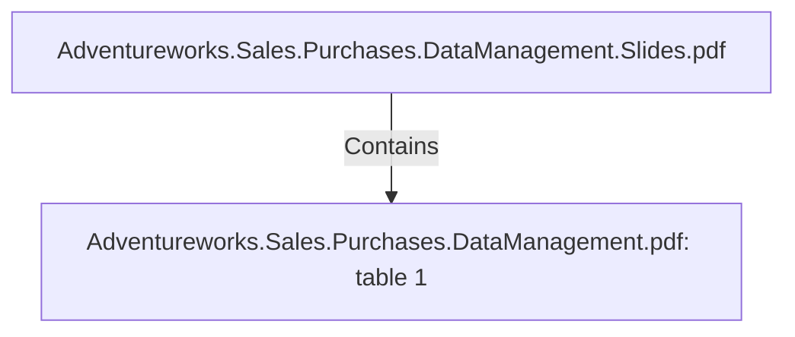

# Adventureworks.Sales.Purchases.DataManagement.pdf: table 1 (Table)

## Properties

| Key | Value |
|---|---|
| `page` | null |
| `rows` | [["Adventure","Works","Cycles","will","create","Sales","and","Purchasing","datamarts","as","they","have","been"],["p rioritized","by","the","comp any’s","management","to","be","the","areas","where","any","imp rovement","from"],["the","analytics","insights","will","have","a","large","imp act","on","financial","key","p erformance","indicators."]] |

## Relationships

### Contains

- ← Adventureworks.Sales.Purchases.DataManagement.Slides.pdf (`f240004c-ab01-5ee9-a371-83bdd1c54d35`) — evidence: table 1 extracted from Adventureworks.Sales.Purchases.DataManagement.pdf

## Diagram

## Evidence

- `cb551b63-aea5-4892-86d3-9a374bd9188c` — table 1 extracted from Adventureworks.Sales.Purchases.DataManagement.pdf (confidence: 1.00)
- `16c8f327-0096-4268-a945-520d6e618518` — table 2 extracted from Adventureworks.Sales.Purchases.DataManagement.pdf (confidence: 1.00)
- `77cc4b19-65f8-4543-96b4-91f514d1083b` — table 3 extracted from Adventureworks.Sales.Purchases.DataManagement.pdf (confidence: 1.00)
- `e98428fb-a8dc-48c3-8755-3ab23844b12d` — table 4 extracted from Adventureworks.Sales.Purchases.DataManagement.pdf (confidence: 1.00)
- `ca771917-9f44-44ea-bd4d-e3268f9efd0f` — table 5 extracted from Adventureworks.Sales.Purchases.DataManagement.pdf (confidence: 1.00)
- `0e549968-6a8b-4c19-8424-41f085040425` — table 6 extracted from Adventureworks.Sales.Purchases.DataManagement.pdf (confidence: 1.00)
- `89333bad-05f5-4969-8b6f-7985193af9d0` — table 7 extracted from Adventureworks.Sales.Purchases.DataManagement.pdf (confidence: 1.00)
- `ce9cdcb7-ef87-40c8-b76d-e8aaa6758e0b` — table 8 extracted from Adventureworks.Sales.Purchases.DataManagement.pdf (confidence: 1.00)
- `57718ac1-77d8-4ee8-84e9-96eaa234456c` — table 9 extracted from Adventureworks.Sales.Purchases.DataManagement.pdf (confidence: 1.00)
- `c4a54b92-a818-48be-bd01-d36f0b3f703e` — table 10 extracted from Adventureworks.Sales.Purchases.DataManagement.pdf (confidence: 1.00)
- `fbcf3e76-35e7-4e26-a495-c7dbb5b90860` — table 11 extracted from Adventureworks.Sales.Purchases.DataManagement.pdf (confidence: 1.00)
- `90bee027-476b-4e16-b245-29021f8ff7ab` — table 12 extracted from Adventureworks.Sales.Purchases.DataManagement.pdf (confidence: 1.00)
- `03e58a67-abf5-4616-9f6a-e3c60b13de39` — table 13 extracted from Adventureworks.Sales.Purchases.DataManagement.pdf (confidence: 1.00)
- `8a6b7621-5f74-4429-88da-a3f10164d8cb` — table 14 extracted from Adventureworks.Sales.Purchases.DataManagement.pdf (confidence: 1.00)
- `877d6d5b-691b-46ef-98bc-b1375148362f` — table 15 extracted from Adventureworks.Sales.Purchases.DataManagement.pdf (confidence: 1.00)
- `9e085ae3-00c8-4291-9e46-462079998223` — table 16 extracted from Adventureworks.Sales.Purchases.DataManagement.pdf (confidence: 1.00)
- `f5eac171-de17-446b-9f17-48f2073578b2` — table 17 extracted from Adventureworks.Sales.Purchases.DataManagement.pdf (confidence: 1.00)
- `1be09921-9f53-4f4c-a392-059351cfccb8` — table 18 extracted from Adventureworks.Sales.Purchases.DataManagement.pdf (confidence: 1.00)
- `f630f1d7-f1a7-4a8b-8670-9276725b3aad` — table 19 extracted from Adventureworks.Sales.Purchases.DataManagement.pdf (confidence: 1.00)
- `68f12550-5c85-4109-a3e2-b8ef5828b82c` — table 20 extracted from Adventureworks.Sales.Purchases.DataManagement.pdf (confidence: 1.00)
