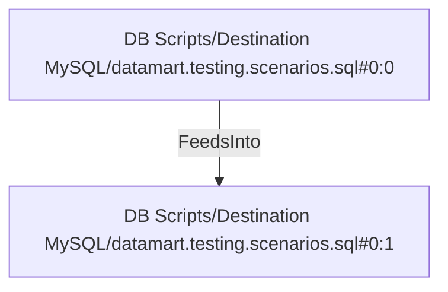

# DB Scripts/Destination MySQL/datamart.testing.scenarios.sql#0:0 (TransformNode)

## Properties

| Key | Value |
|---|---|
| `columns` | [] |
| `node_type` | Source |
| `object_name` | dim_product |

## Relationships

### FeedsInto

- → DB Scripts/Destination MySQL/datamart.testing.scenarios.sql#0:1 (`89f7d38b-1aab-5e25-a344-e0bd14e7185f`)

## Diagram

## Evidence

- `7f174085-a700-5f98-8b46-97865ac061c3` — dim_product (confidence: 1.00)
