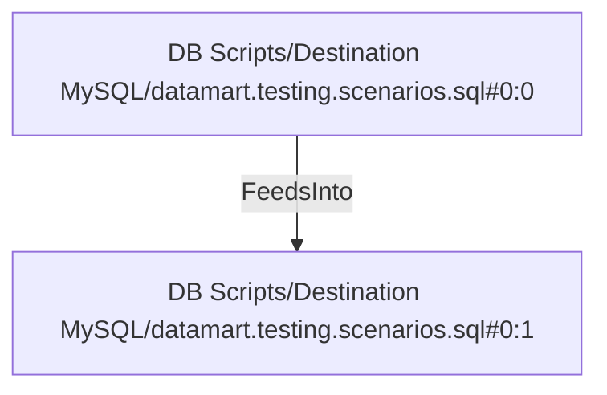

# DB Scripts/Destination MySQL/datamart.testing.scenarios.sql#0:1 (TransformNode)

## Properties

| Key | Value |
|---|---|
| `excerpt` | product_id = 875 |
| `node_type` | Filter |

## Relationships

### FeedsInto

- ← DB Scripts/Destination MySQL/datamart.testing.scenarios.sql#0:0 (`11a5f038-5479-5238-8ccd-17dc6f7dc699`)

## Diagram

## Evidence

- `f96f597f-9b41-55d7-9437-13ea35e8c00a` — product_id = 875 (confidence: 1.00)
