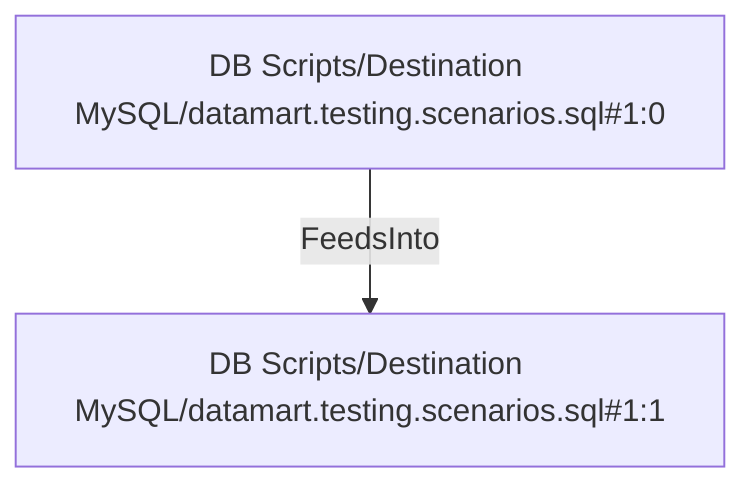

# DB Scripts/Destination MySQL/datamart.testing.scenarios.sql#1:0 (TransformNode)

## Properties

| Key | Value |
|---|---|
| `columns` | [] |
| `node_type` | Source |
| `object_name` | fact_sales |

## Relationships

### FeedsInto

- → DB Scripts/Destination MySQL/datamart.testing.scenarios.sql#1:1 (`46598e42-7763-514a-8751-0f595ed677d5`)

## Diagram

## Evidence

- `e4a03145-59e6-5426-b512-9972862bc562` — fact_sales (confidence: 1.00)
