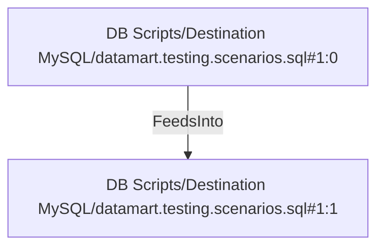

# DB Scripts/Destination MySQL/datamart.testing.scenarios.sql#1:1 (TransformNode)

## Properties

| Key | Value |
|---|---|
| `excerpt` | sales_order_detail_id = 35893 |
| `node_type` | Filter |

## Relationships

### FeedsInto

- ← DB Scripts/Destination MySQL/datamart.testing.scenarios.sql#1:0 (`d5781ac2-ca4e-52bc-8b1e-36a9aba14130`)

## Diagram

## Evidence

- `22b36453-4043-544e-9a53-0c8418bdfae9` — sales_order_detail_id = 35893 (confidence: 1.00)
