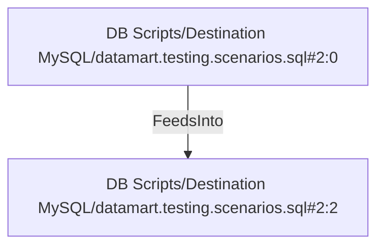

# DB Scripts/Destination MySQL/datamart.testing.scenarios.sql#2:0 (TransformNode)

## Properties

| Key | Value |
|---|---|
| `columns` | [] |
| `node_type` | Source |
| `object_name` | fact_sales |

## Relationships

### FeedsInto

- → DB Scripts/Destination MySQL/datamart.testing.scenarios.sql#2:2 (`d95e468e-1463-5b13-9e43-7b53bcb6e0e8`)

## Diagram

## Evidence

- `9bee06f0-f146-50d5-98a6-67894fbd4b21` — fact_sales (confidence: 1.00)
