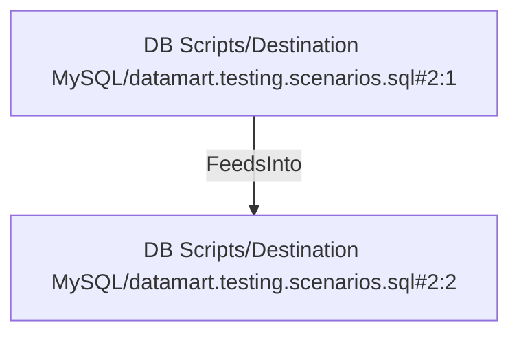

# DB Scripts/Destination MySQL/datamart.testing.scenarios.sql#2:1 (TransformNode)

## Properties

| Key | Value |
|---|---|
| `columns` | [] |
| `node_type` | Source |
| `object_name` | dim_product |

## Relationships

### FeedsInto

- → DB Scripts/Destination MySQL/datamart.testing.scenarios.sql#2:2 (`d95e468e-1463-5b13-9e43-7b53bcb6e0e8`)

## Diagram

## Evidence

- `d93a8909-7314-5221-9f41-0e5cfb016b36` — dim_product (confidence: 1.00)
