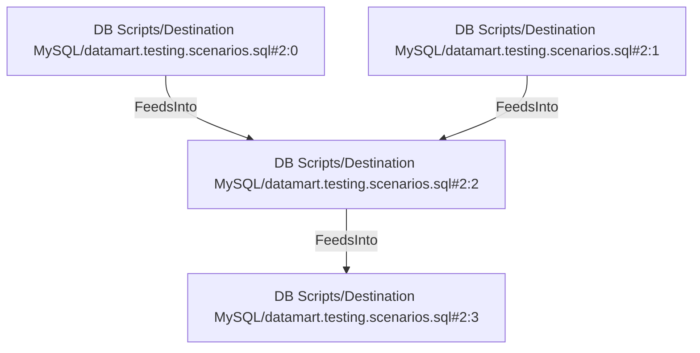

# DB Scripts/Destination MySQL/datamart.testing.scenarios.sql#2:2 (TransformNode)

## Properties

| Key | Value |
|---|---|
| `join_kind` | Inner |
| `keys` | [["s.dim_product_id","p.dim_product_id"]] |
| `left` | 0 |
| `node_type` | Join |
| `right` | 1 |

## Relationships

### FeedsInto

- → DB Scripts/Destination MySQL/datamart.testing.scenarios.sql#2:3 (`0a079edb-2efb-5bec-ac83-8f4c8bd3eb25`)
- ← DB Scripts/Destination MySQL/datamart.testing.scenarios.sql#2:0 (`421db59f-415a-5f93-9de2-138253399948`)
- ← DB Scripts/Destination MySQL/datamart.testing.scenarios.sql#2:1 (`3d1e41c2-d8b2-550d-b111-52ba283c0637`)

## Diagram

## Evidence

- `e9f204da-8522-5ed5-a442-dda05dcb3d6e` — Inner JOIN ON [("s.dim_product_id", "p.dim_product_id")] (confidence: 1.00)
