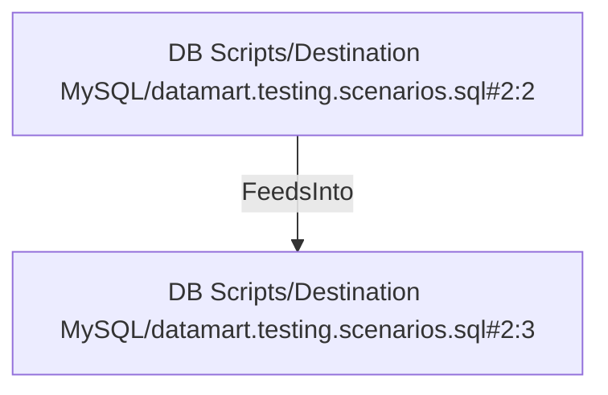

# DB Scripts/Destination MySQL/datamart.testing.scenarios.sql#2:3 (TransformNode)

## Properties

| Key | Value |
|---|---|
| `excerpt` | s.sales_order_id = 51092 AND p.product_id = 737 |
| `node_type` | Filter |

## Relationships

### FeedsInto

- ← DB Scripts/Destination MySQL/datamart.testing.scenarios.sql#2:2 (`d95e468e-1463-5b13-9e43-7b53bcb6e0e8`)

## Diagram

## Evidence

- `3188e8f9-c671-541c-b05a-bbb0339761d1` — s.sales_order_id = 51092 AND p.product_id = 737 (confidence: 1.00)
