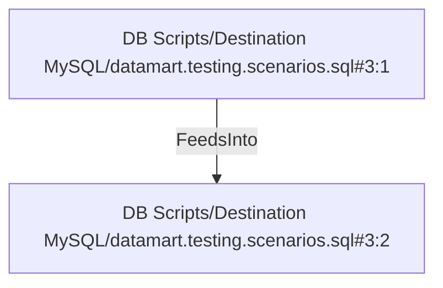

# DB Scripts/Destination MySQL/datamart.testing.scenarios.sql#3:1 (TransformNode)

## Properties

| Key | Value |
|---|---|
| `columns` | [] |
| `node_type` | Source |
| `object_name` | dim_product |

## Relationships

### FeedsInto

- → DB Scripts/Destination MySQL/datamart.testing.scenarios.sql#3:2 (`0c5e40a1-01ac-522b-aebf-7cfab887c9c7`)

## Diagram

## Evidence

- `44e3091a-4276-5795-9b14-d6abca30abfd` — dim_product (confidence: 1.00)
