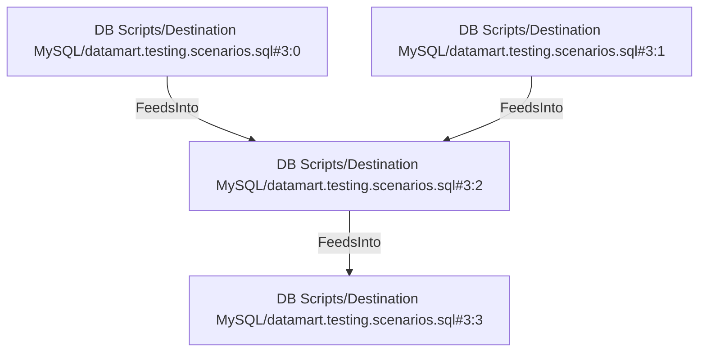

# DB Scripts/Destination MySQL/datamart.testing.scenarios.sql#3:2 (TransformNode)

## Properties

| Key | Value |
|---|---|
| `join_kind` | Inner |
| `keys` | [["po.dim_product_id","p.dim_product_id"]] |
| `left` | 0 |
| `node_type` | Join |
| `right` | 1 |

## Relationships

### FeedsInto

- → DB Scripts/Destination MySQL/datamart.testing.scenarios.sql#3:3 (`9ebb1e63-1883-51a5-ba86-4de5d1eea0f5`)
- ← DB Scripts/Destination MySQL/datamart.testing.scenarios.sql#3:0 (`1ad8cca6-5cea-5722-87f3-7507db631292`)
- ← DB Scripts/Destination MySQL/datamart.testing.scenarios.sql#3:1 (`5a2080fb-8cc6-57e0-a9c6-09fd7854fb74`)

## Diagram

## Evidence

- `d6c83102-82c6-5093-a60b-aaea0a1cfc91` — Inner JOIN ON [("po.dim_product_id", "p.dim_product_id")] (confidence: 1.00)
