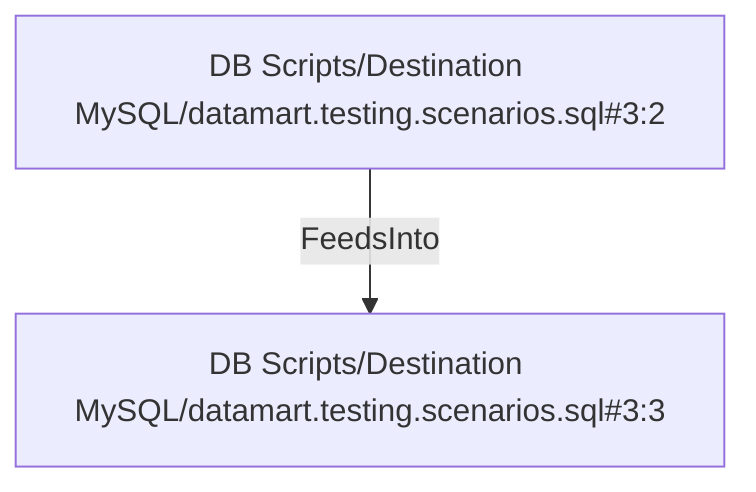

# DB Scripts/Destination MySQL/datamart.testing.scenarios.sql#3:3 (TransformNode)

## Properties

| Key | Value |
|---|---|
| `excerpt` | product_id = 875 |
| `node_type` | Filter |

## Relationships

### FeedsInto

- ← DB Scripts/Destination MySQL/datamart.testing.scenarios.sql#3:2 (`0c5e40a1-01ac-522b-aebf-7cfab887c9c7`)

## Diagram

## Evidence

- `212daf36-7387-576e-ab92-5b5895ea3f65` — product_id = 875 (confidence: 1.00)
