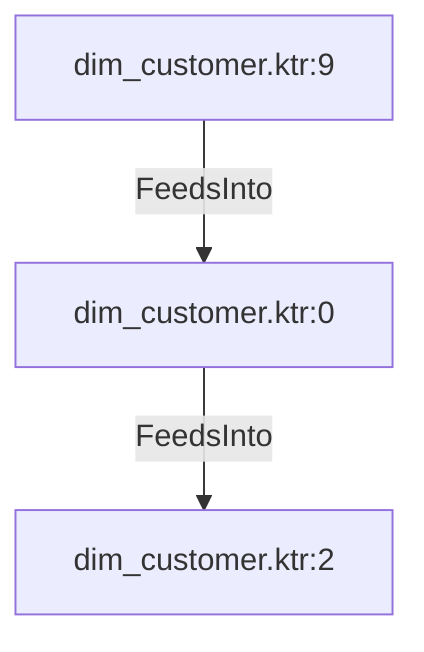

# dim_customer.ktr:0 (TransformNode)

## Properties

| Key | Value |
|---|---|
| `node_type` | Unmapped |
| `raw` | <step>
    <name>Create dummy for reseller</name>
    <type>ScriptValueMod</type>
    <description/>
    <distribute>Y</distribute>
    <custom_distribution/>
    <copies>1</copies>
    <partitioning>
      <method>none</method>
      <schema_name/>
    </partitioning>
    <compatible>N</compatible>
    <optimizationLevel>9</optimizationLevel>
    <jsScripts>
      <jsScript>
        <jsScript_type>0</jsScript_type>
        <jsScript_name>Script 1</jsScript_name>
        <jsScript_script>var calculated_is_reseller
if(StoreID != null)
	calculated_is_reseller = 1
else 
	calculated_is_reseller = 0;
	

</jsScript_script>
      </jsScript>
    </jsScripts>
    <fields>
      <field>
        <name>calculated_is_reseller</name>
        <rename>calculated_is_reseller</rename>
        <type>Number</type>
        <length>16</length>
        <precision>2</precision>
        <replace>N</replace>
      </field>
    </fields>
    <attributes/>
    <cluster_schema/>
    <remotesteps>
      <input>
      </input>
      <output>
      </output>
    </remotesteps>
    <GUI>
      <xloc>1056</xloc>
      <yloc>592</yloc>
      <draw>Y</draw>
    </GUI>
  </step> |
| `reason` | unrecognized step type: ScriptValueMod |

## Relationships

### FeedsInto

- → dim_customer.ktr:2 (`5bf8b341-de05-5f20-900e-6f7c43807663`)
- ← dim_customer.ktr:9 (`13a1cc5a-f528-5e37-aa60-650e1632c222`)

## Diagram

## Evidence

- `fc1250c2-1bfa-581f-b10f-b32e659cd012` — <step>
    <name>Create dummy for reseller</name>
    <type>ScriptValueMod</type>
    <description/>
    <distribute>Y</distribute>
    <custom_distribution/>
    <copies>1</copies>
    <partitioning>
      <method>none</method>
      <schema_name/>
    </partitioning>
    <compatible>N</compatible>
    <optimizationLevel>9</optimizationLevel>
    <jsScripts>
      <jsScript>
        <jsScript_type>0</jsScript_type>
        <jsScript_name>Script 1</jsScript_name>
        <jsScript_script>var calculated_is_reseller
if(StoreID != null)
	calculated_is_reseller = 1
else 
	calculated_is_reseller = 0;
	

</jsScript_script>
      </jsScript>
    </jsScripts>
    <fields>
      <field>
        <name>calculated_is_reseller</name>
        <rename>calculated_is_reseller</rename>
        <type>Number</type>
        <length>16</length>
        <precision>2</precision>
        <replace>N</replace>
      </field>
    </fields>
    <attributes/>
    <cluster_schema/>
    <remotesteps>
      <input>
      </input>
      <output>
      </output>
    </remotesteps>
    <GUI>
      <xloc>1056</xloc>
      <yloc>592</yloc>
      <draw>Y</draw>
    </GUI>
  </step> (confidence: 1.00)
